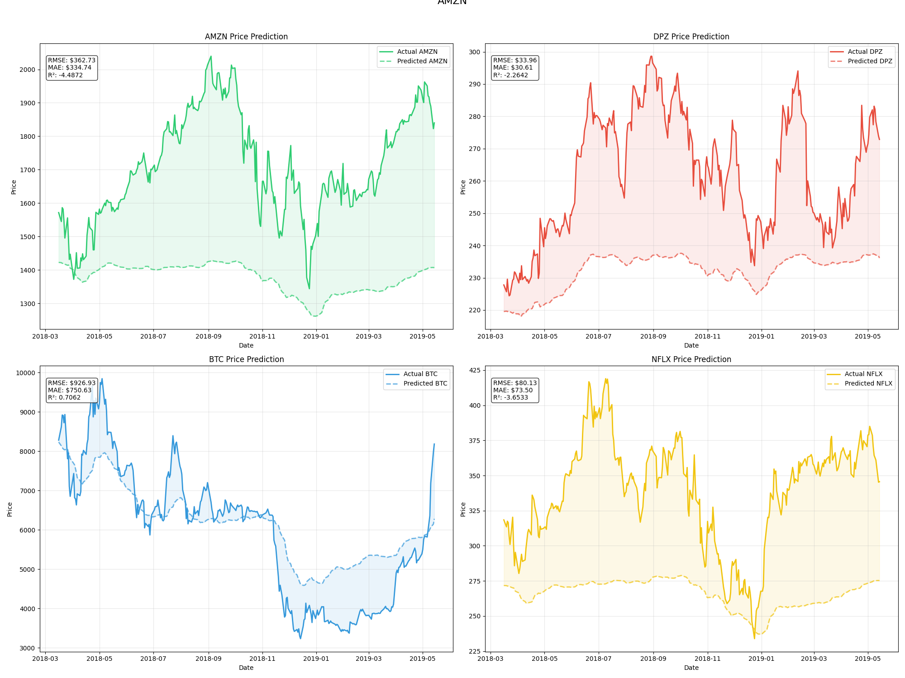

# # Stock Price Prediction using LSTM 📈


## 📊 Project Overview

This project implements a stock price prediction model using Long Short-Term Memory (LSTM) networks. The model analyzes historical price data for multiple assets (AMZN, DPZ, BTC, NFLX) to predict future price movements.

### 🎯 Key Features

- Multi-asset price prediction
- Real-time training visualization
- Comprehensive performance metrics
- Interactive Jupyter notebook implementation
- Data preprocessing and validation
- Advanced LSTM architecture

## 📈 Visualizations

### Historical Price Data

*Historical price trends for all assets in the portfolio*

### Training Progress

*Model training progress showing loss reduction over epochs*

### Prediction Results

*Actual vs Predicted prices for target asset*

## 🛠️ Technical Architecture

### Data Processing Pipeline
```
Load Data → Preprocess → Create Sequences → Scale → Train/Test Split
```

### LSTM Model Architecture
- Input Layer: Sequence length of 60 timesteps
- LSTM Layer 1: 128 units with dropout
- LSTM Layer 2: 64 units with dropout
- Dense Output Layer: Multi-asset prediction

## 📝 Implementation Details

### Data Preprocessing
- Handles missing values automatically
- Implements MinMax scaling
- Creates sliding window sequences
- Performs train-test splitting

### Model Configuration
- Sequence Length: 60 days
- Test Split: 20%
- Batch Size: 32
- Learning Rate: Adaptive (with ReduceLROnPlateau)
- Early Stopping: Patience of 15 epochs

## 🚀 Getting Started

1. **Clone the Repository**
   ```bash
   git clone https://github.com/shretadas/Stock-Price-Prediction-using-LSTM.git
   cd Stock-Price-Prediction-using-LSTM
   ```

2. **Install Dependencies**
   ```bash
   pip install -r requirements.txt
   ```

3. **Run the Jupyter Notebook**
   ```bash
   jupyter notebook Stock_Price_Prediction.ipynb
   ```

## 📊 Model Performance

The model's performance is evaluated using:
- Mean Squared Error (MSE)
- Mean Absolute Error (MAE)
- Real vs Predicted Price Comparisons

## 🔧 Technologies Used

- TensorFlow 2.x
- Python 3.x
- Pandas
- NumPy
- Matplotlib
- Scikit-learn

## 📁 Project Structure

```
Stock-Price-Prediction-using-LSTM/
│
├── data/
│   └── portfolio_data.csv
│
├── images/
│   ├── historical_prices.png
│   ├── training_progress.png
│   └── predictions.png
│
├── models/
│   └── best_model.h5
│
├── Stock_Price_Prediction.ipynb
├── requirements.txt
└── README.md
```

## ✨ Features

- [x] Multi-asset price prediction
- [x] Real-time training visualization
- [x] Automatic data preprocessing
- [x] Model checkpoint saving
- [x] Performance visualization
- [x] Error analysis

## 🤝 Contributing

Contributions are welcome! Please feel free to submit a Pull Request.

## 📄 License

This project is licensed under the MIT License - see the [LICENSE](LICENSE) file for details.

## 👥 Authors

- [Shreta Das](https://github.com/shretadas)

---

<p align="center">
Made with ❤️ and TensorFlow
</p>