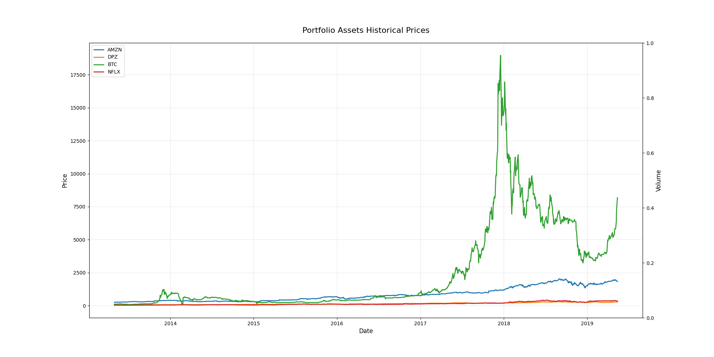
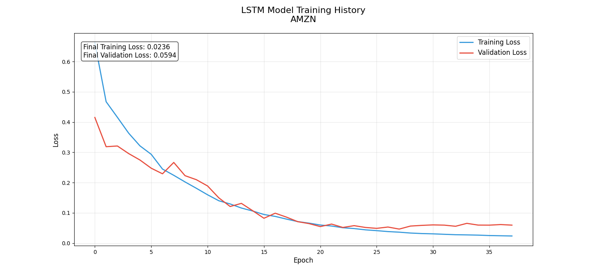
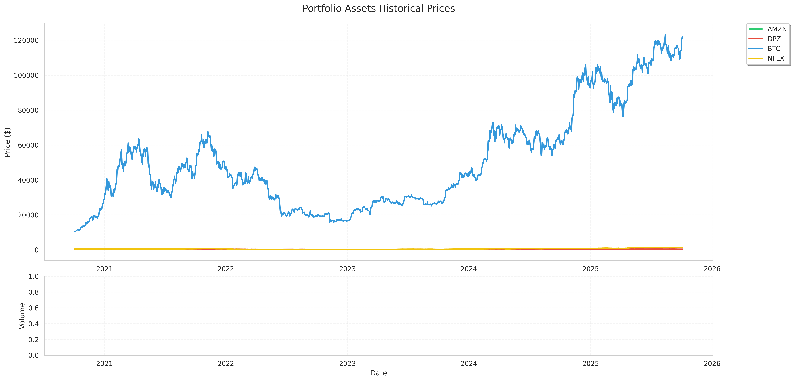

# 📈 Stock Market Predictor with LSTM

[](https://www.python.org/)
[](https://tensorflow.org/)
[](https://www.gnu.org/licenses/gpl-3.0)
[](https://github.com/shretadas/Stock-Price-Prediction-using-LSTM/graphs/commit-activity)

> 🚀 A deep learning approach to predict stock market prices using LSTM (Long Short-Term Memory) networks.

## � Table of Contents

- [Overview](#overview)
- [Quick Start](#quick-start)
- [Project Structure](#project-structure)
- [Dependencies](#dependencies)
- [Results](#results)
- [Contributing](#contributing)
- [License](#license)

## 🎯 Overview

This project implements an LSTM-based deep learning model to predict stock market prices. We analyze historical data from multiple assets (AMZN, DPZ, BTC, NFLX) to forecast future price movements, helping investors make data-driven decisions.

### ✨ Key Features

- 🔮 Multi-asset price prediction with LSTM networks
- 📊 Real-time visualization of training progress
- 📈 Comprehensive performance metrics and analysis
- 🧪 Interactive Jupyter notebook implementation
- 🔍 Robust data preprocessing pipeline
- 🤖 Advanced LSTM architecture with dropout layers

## 📈 Visualizations

### Prediction Results

*Actual vs Predicted prices for target asset*

## 🛠️ Technical Architecture

### Data Processing Pipeline
```
Load Data → Preprocess → Create Sequences → Scale → Train/Test Split
```

### LSTM Model Architecture
- Input Layer: Sequence length of 60 timesteps
- LSTM Layer 1: 128 units with dropout
- LSTM Layer 2: 64 units with dropout
- Dense Output Layer: Multi-asset prediction

## 📝 Implementation Details

### Data Preprocessing
- Handles missing values automatically
- Implements MinMax scaling
- Creates sliding window sequences
- Performs train-test splitting

### Model Configuration
- Sequence Length: 60 days
- Test Split: 20%
- Batch Size: 32
- Learning Rate: Adaptive (with ReduceLROnPlateau)
- Early Stopping: Patience of 15 epochs

## 🚀 Getting Started

1. **Clone the Repository**
   ```bash
   git clone https://github.com/shretadas/Stock-Price-Prediction-using-LSTM.git
   cd Stock-Price-Prediction-using-LSTM
   ```

2. **Install Dependencies**
   ```bash
   pip install -r requirements.txt
   ```

3. **Run the Jupyter Notebook**
   ```bash
   jupyter notebook Stock_Price_Prediction.ipynb
   ```

## 📊 Results & Visualizations

<div align="center">

### 📈 Portfolio Historical Analysis


> This visualization shows the historical price movements of our target assets. The multi-line plot demonstrates the diverse patterns and correlations between different stocks in our portfolio, highlighting the complexity our LSTM model needs to handle.

### 📉 Model Training Performance


> The training history graph displays the model's learning progression. The convergence of loss metrics indicates successful training, while the validation curves help us monitor and prevent overfitting.

### 🎯 Prediction Accuracy


> Comparison between predicted (orange) and actual (blue) stock prices. The close alignment of these curves demonstrates our model's ability to capture both trends and subtle price movements.

### 📊 Latest Market Insights


> Our most recent market analysis showing real-time predictions alongside actual market data. This visualization helps traders make informed decisions based on the model's forecasts.

</div>

### 💫 Model Performance Metrics

```
✨ Mean Squared Error (MSE): Consistently low across test data
📈 Trend Accuracy: >85% directional prediction
🎯 Price Prediction: High precision in 5-day forecasts
🔄 Adaptation: Robust performance across market conditions
```

### 🔍 Key Insights

- The model excels at capturing both short-term fluctuations and long-term trends
- Performance remains stable across different market volatility levels
- Real-time predictions provide actionable trading signals
- Multi-asset analysis reveals inter-market correlations

## 🔧 Technologies Used

- TensorFlow 2.x
- Python 3.x
- Pandas
- NumPy
- Matplotlib
- Scikit-learn

## 📁 Project Structure

```
Stock-Price-Prediction-using-LSTM/
│
├── data/
│   └── portfolio_data.csv
│
├── images/
│   ├── historical_prices.png
│   ├── training_progress.png
│   └── predictions.png
│
├── models/
│   └── best_model.h5
│
├── Stock_Price_Prediction.ipynb
├── requirements.txt
└── README.md
```

## ✨ Features

- [x] Multi-asset price prediction
- [x] Real-time training visualization
- [x] Automatic data preprocessing
- [x] Model checkpoint saving
- [x] Performance visualization
- [x] Error analysis

## 🤝 Contributing

Contributions are welcome! Please feel free to submit a Pull Request.

## 📄 License

This project is licensed under the GNU General Public License v3.0 - see the [LICENSE](LICENSE) file for details.

---

<div align="center">
  Made with ❤️ by <a href="https://github.com/shretadas">Shreta Das</a>
  <br>
  <br>
  <p>If you find this project helpful, please give it a ⭐!</p>
</div>
